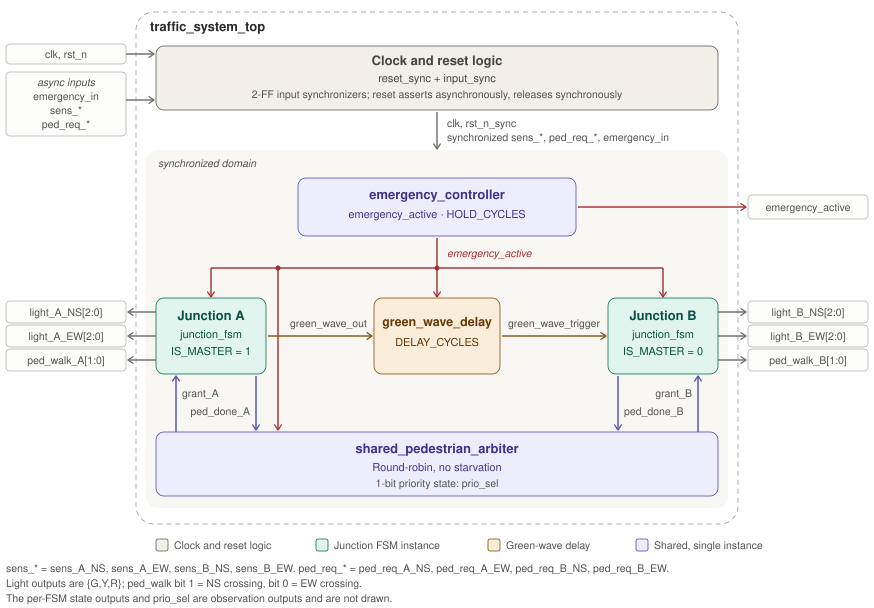
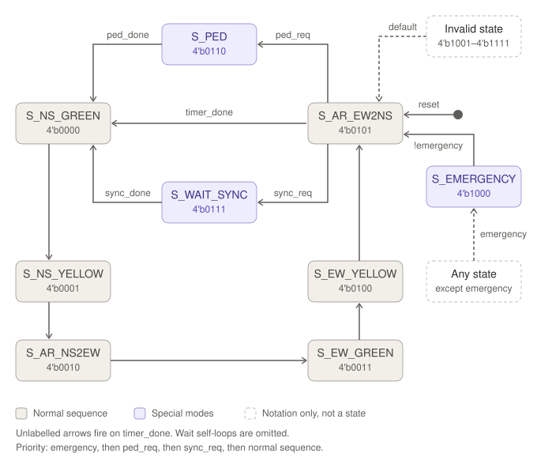

# Adaptive Traffic Controller — System Architecture and Planning  

1. System Overview & Design Objectives
   
    1.1 System Overview

  	This project is an adaptive traffic controller for two four-way junctions, called Junction A and Junction B. Each junction controls four approaches (North,        South, East and West), 	which are grouped into two phases: North-South (NS) and East-West (EW). Each junction cycles through its phases in the usual green,        yellow and red sequence. The NS and EW phases of      	 a junction are never green at the same time, so conflicting traffic is always separated.

  	The two junctions are designed to work together rather than independently, and three mechanisms tie them together. The first is the green-wave mechanism.          Junction B's NS green 	signal 	starts a fixed, configurable number of clock cycles after Junction A's NS green signal starts. Vehicles that leave Junction A      on the NS route then reach Junction B while 	its NS 	signal is green, which reduces stops and improves traffic flow.

	 The second mechanism is a shared pedestrian arbiter. Instead of giving each junction its own pedestrian controller, the design has a single arbiter that           receives pedestrian 	requests from both junctions and decides which one to serve first. It uses a fair scheme, so neither junction is ignored and every request    is eventually served.
	
	 The third mechanism is a single global emergency override input. When it is asserted, both junctions move safely to an all-red state within a specified number     of clock cycles. They 	stay in that state while the emergency is active and return to normal operation once it is released.

   1.2 Design Objectives

	 The first objective is correct normal sequencing. Each junction must run its NS and EW phases with proper green, yellow and red timing, and it must do so on       its own when no 	coordination event is active.

	 The second objective is safety. At no point may the NS and EW signals of the same junction be green together. This rule also applies during the transitions        caused by pedestrian 	service and emergency handling, not just during normal operation.

	The third objective is green-wave coordination. Junction B's NS green must begin a defined number of clock cycles after Junction A's NS green. This delay is       held in a named 	parameter so it can be changed without altering the design and checked exactly in simulation.

	The fourth objective is shared pedestrian control. One arbiter serves both junctions, which avoids duplicated logic and gives a single place where pedestrian      crossings are 	scheduled.

	The fifth objective is fairness. When both junctions request a pedestrian crossing at the same time, one is served first and the other is guaranteed the next      turn. Repeated 	requests from one junction must not block the other indefinitely, so no junction is starved.

	The sixth objective is bounded emergency response. After the emergency input is asserted, both junctions must reach the all-red state within a fixed maximum       number of clock cycles 	and remain there for as long as the input stays active. After release, the system resumes normal operation in a safe, known state.

	The seventh objective is predictable behaviour. The design uses a single clock domain and one reset strategy, so its behaviour is deterministic and free from      clock-crossing 	problems.

	The eighth objective is verifiability. The design is split into modules with clearly defined interfaces, so each block can be tested in isolation and then         together, and every 	requirement can be checked against a specific test scenario.

## 2.Top-Level Architecture & Block Diagram  

###High-Level System Architecture

### FSM State Diagram

		
3. Module Interfaces & Architectural Justification

The traffic controller is partitioned into independent RTL modules to provide clear functional boundaries, simplify verification, and allow the architecture to be extended in future implementations.

The main modules are:

traffic_system_top
junction_fsm, instantiated for Junction A (IS_MASTER = 1)
junction_fsm, instantiated for Junction B (IS_MASTER = 0)
emergency_controller
shared_pedestrian_arbiter
green_wave_delay
Clock and reset logic (reset_sync, input_sync)

3.1 Module Partitioning Justification
	Separate FSMs for Junction A and Junction B

Junction A and Junction B use separate instances of the same junction_fsm module because each intersection must maintain its own local traffic-light state and timing counters. Each 	FSM independently controls its local NS/EW signals. A IS_MASTER parameter selects the synchronization role. Junction A is the free-running reference junction. Junction B aligns its 	NS green phase to a delayed synchronization pulse from Junction A. Because both junctions use the same module, they can be verified independently, and further junctions can be 	added later by instantiating more copies. The green-wave mechanism coordinates the junctions without merging their local state machines into one large FSM.

   Separate Green-Wave Delay Block

The corridor delay between Junction A and Junction B is implemented in a dedicated green_wave_delay module with a configurable delay parameter. This keeps the corridor-specific 	timing offset out of the junction FSM, so the FSM stays identical for A and B, and changing the corridor spacing means changing one parameter.

   Separate Emergency Controller

  Emergency policy (input conditioning and minimum hold time) is kept in its own module so it is defined once and distributed to every block as a single emergency_active signal. The 	safe transition itself, which passes through yellow before all-red, is executed inside each junction FSM because it depends on that junction's current phase.

 Shared Pedestrian Arbiter
	
   A pedestrian phase holds all vehicle signals red at its junction. If adjacent junctions could both enter pedestrian phases at the same time, the whole corridor would stall and the 	green-wave alignment would be lost. The system therefore enforces a corridor rule: at most one junction may be in a pedestrian service phase at any time. A single shared arbiter 	enforces this rule instead of duplicating arbitration logic in both junction controllers.

  This provides:

   Resource efficiency: Request latching, priority state, and grant logic are implemented once. The walk timing itself remains in each junction FSM.
   Corridor coordination: Pedestrian phases at adjacent junctions are serialized, so they cannot both block the corridor.
   Deterministic behavior: Simultaneous requests are resolved by a defined priority mechanism.
   Scalability: The arbitration mechanism can be extended if additional junctions or pedestrian phases are introduced.
   Starvation Prevention

The arbiter uses a round-robin priority mechanism with a 1-bit state, prio_sel (0 = Junction A preferred, 1 = Junction B preferred). 
	The rules are:

Each junction's request is the OR of its two crossing requests. It is latched into a pending flag whenever it arrives, including while the other junction is being served.
	If the arbiter is idle and only one junction is pending, that junction is granted immediately.
	If both junctions are pending, including when the arbiter becomes idle with both waiting, the grant goes to the junction selected by prio_sel. The other junction stays pending.
	The pending flag is cleared when its grant is issued, so a request arriving during service is latched again for the next round.
	The grant is held until that junction's ped_done pulse, or until emergency_active aborts it.
	After every completed grant, prio_sel flips to point at the junction that was not just served. The flip is unconditional, not only for contested requests.

As a result, a pending junction never waits longer than one pedestrian service cycle of the other junction.

  3.2 Module Interface Definitions
     3.2.1 traffic_system_top

   The top-level module connects all functional blocks and provides the external system interface. All external inputs are treated as asynchronous and are synchronized inside the top 	level (see 3.2.6).

| Signal Name | Direction | Width | Description / Purpose |
|---|---|---:|---|
| `clk` | Input | 1 | Master system clock |
| `rst_n` | Input | 1 | Active-low asynchronous system reset (synchronized internally) |
| `emergency_in` | Input | 1 | Emergency override input |
| `sens_A_NS` | Input | 1 | Vehicle detection for Junction A North-South direction |
| `sens_A_EW` | Input | 1 | Vehicle detection for Junction A East-West direction |
| `sens_B_NS` | Input | 1 | Vehicle detection for Junction B North-South direction |
| `sens_B_EW` | Input | 1 | Vehicle detection for Junction B East-West direction |
| `ped_req_A_NS` | Input | 1 | Pedestrian request for Junction A NS crossing |
| `ped_req_A_EW` | Input | 1 | Pedestrian request for Junction A EW crossing |
| `ped_req_B_NS` | Input | 1 | Pedestrian request for Junction B NS crossing |
| `ped_req_B_EW` | Input | 1 | Pedestrian request for Junction B EW crossing |
| `light_A_NS` | Output | 3 | Junction A NS lights, `{G,Y,R}` |
| `light_A_EW` | Output | 3 | Junction A EW lights, `{G,Y,R}` |
| `light_B_NS` | Output | 3 | Junction B NS lights, `{G,Y,R}` |
| `light_B_EW` | Output | 3 | Junction B EW lights, `{G,Y,R}` |
| `ped_walk_A` | Output | 2 | Junction A WALK indication: bit 1 = NS crossing, bit 0 = EW crossing |
| `ped_walk_B` | Output | 2 | Junction B WALK indication: bit 1 = NS crossing, bit 0 = EW crossing |
| `emergency_active` | Output | 1 | Indicates that emergency override is active |
	Architectural Purpose

traffic_system_top is the integration module. It does not contain the detailed traffic-control state machines. It instantiates the clock and reset logic, the two junction FSMs, the 	green-wave delay block, the emergency controller, and the pedestrian arbiter, and connects them. It also exposes the green-wave delay as a top-level parameter.

3.2.2 junction_fsm

The same FSM module is instantiated twice: once for Junction A and once for Junction B.

| Signal Name | Direction | Width | Description / Purpose |
|---|---|---:|---|
| `clk` | Input | 1 | Master system clock |
| `rst_n` | Input | 1 | Active-low synchronized reset |
| `sens_NS` | Input | 1 | Vehicle detection in NS direction |
| `sens_EW` | Input | 1 | Vehicle detection in EW direction |
| `ped_req` | Input | 2 | Per-crossing pedestrian requests: bit 1 = NS, bit 0 = EW. Latched inside the FSM |
| `ped_grant` | Input | 1 | Pedestrian service permission from the arbiter |
| `green_wave_trigger` | Input | 1 | Delayed synchronization pulse (Junction B). Tied to `1'b0` on Junction A |
| `emergency_active` | Input | 1 | Forces the emergency-safe sequence |
| `light_NS` | Output | 3 | NS lights, `{G,Y,R}` |
| `light_EW` | Output | 3 | EW lights, `{G,Y,R}` |
| `green_wave_out` | Output | 1 | One-cycle pulse when this junction enters NS Green. Used by Junction A, left unconnected on Junction B |
| `ped_walk` | Output | 2 | WALK indication per crossing: bit 1 = NS, bit 0 = EW |
| `ped_done` | Output | 1 | One-cycle pulse when the pedestrian phase completes or is aborted |
| `state` | Output | 4 | Encoded current FSM state for verification/debugging |

	Phase-duration parameters (minimum/maximum green, yellow, all-red, walk time) are also module parameters.
| Parameter | Description |
|---|---|
| `IS_MASTER` | `1` = free-running reference junction (A). `0` = waits for `green_wave_trigger` (B) |
| `SYNC_TIMEOUT` | Maximum cycles Junction B waits for a trigger before free-running |

Architectural Purpose

	The FSM controls the local traffic-light sequence:
 	
	NS GREEN
	    ↓
	NS YELLOW
	   ↓
	ALL RED
 	  ↓
	EW GREEN
	   ↓
	EW YELLOW
 	  ↓
	ALL RED
	   ↓
	NS GREEN

Traffic detection inputs influence the duration or selection of phases according to the adaptive-control requirements. Each green phase stays within fixed minimum and maximum 	limits so that neither direction is starved.

Pedestrian service. The FSM latches ped_req per crossing. When ped_grant is asserted and a request is latched, the FSM enters the pedestrian phase at the next all-red clearance 	state. All vehicle signals stay red, and ped_walk is asserted for each latched crossing. Both crossings can be walked together because no vehicle signal is green. After the walk 	time, ped_walk is cleared, ped_done pulses for one cycle, and the FSM continues to the phase that would have followed that all-red state. The served request latches are cleared on 	entry to the pedestrian phase, so a request arriving during it is kept for the next grant. If a grant arrives with no latched request, the FSM pulses ped_done immediately so the 	arbiter never waits indefinitely.

Green wave. Every instance pulses green_wave_out when it enters NS Green. On Junction A (IS_MASTER = 1), the FSM goes directly from the EW-to-NS all-red state into NS Green, and 	green_wave_trigger is tied low. On Junction B (IS_MASTER = 0), the FSM holds in an all-red wait state until a trigger has been received (see 3.3), and its green_wave_out can be 	left unconnected or used to chain a further junction.

Emergency. The FSM's behavior under emergency_active is described in 3.2.3.

3.2.3 emergency_controller

The emergency controller overrides normal traffic operation when an emergency condition is detected.

| Signal Name | Direction | Width | Description / Purpose |
|---|---|---:|---|
| `clk` | Input | 1 | Master system clock |
| `rst_n` | Input | 1 | Active-low synchronized reset |
| `emergency_in` | Input | 1 | Synchronized external emergency request |
| `emergency_active` | Output | 1 | Indicates active emergency mode |

| Parameter | Description |
|---|---|
| `HOLD_CYCLES` | Minimum number of cycles `emergency_active` stays asserted once triggered |
	Architectural Purpose

Emergency behavior is separated from the normal traffic FSM so that the override policy is defined once instead of being duplicated across every normal traffic-state transition. 	emergency_active is asserted when emergency_in is detected. It stays asserted for at least HOLD_CYCLES and until emergency_in has been released, so a brief glitch cannot leave a 	junction in a partial emergency sequence. The signal is distributed to both junction FSMs, the pedestrian arbiter, the green-wave delay block, and the top-level output. Separate 	all_red_A/B outputs are not used, because each FSM derives its own safe transition from emergency_active.

Emergency Entry and Exit
	Entry from a green phase: The FSM moves to the corresponding yellow phase, completes the full yellow interval, then enters S_EMERGENCY. A green is never cut directly to red.
	Entry from yellow: The FSM completes the yellow interval, then enters S_EMERGENCY.
	Entry from an all-red or wait state: The FSM enters S_EMERGENCY directly.
	Entry from a pedestrian phase: WALK is cleared immediately, ped_done is pulsed, and the FSM enters S_EMERGENCY.
	During emergency: All vehicle signals are red and WALK is off. The arbiter drops any active grant and returns to idle. Pending requests are retained and served after the emergency.
	Exit: When emergency_active deasserts, the FSM moves to the EW-to-NS all-red state and resumes the normal sequence from NS Green. Junction B then follows the green-wave wait rule.

  Because emergency_in carries no direction information, the design cannot give green to the approaching emergency vehicle. All-red is the safe state, and the emergency vehicle 	proceeds under its own right-of-way authority. Direction-aware preemption is a possible future extension.

 3.2.4 shared_pedestrian_arbiter

 The pedestrian arbiter receives requests from both junctions and determines which junction is permitted to enter its pedestrian service phase.

| Signal Name | Direction | Width | Description / Purpose |
|---|---|---:|---|
| `clk` | Input | 1 | Master system clock |
| `rst_n` | Input | 1 | Active-low synchronized reset |
| `ped_req_A` | Input | 2 | Junction A NS/EW pedestrian requests |
| `ped_req_B` | Input | 2 | Junction B NS/EW pedestrian requests |
| `ped_done_A` | Input | 1 | Completion pulse for the Junction A pedestrian cycle |
| `ped_done_B` | Input | 1 | Completion pulse for the Junction B pedestrian cycle |
| `emergency_active` | Input | 1 | Clears active grants so the arbiter never waits on an aborted cycle |
| `grant_A` | Output | 1 | Grants pedestrian service to Junction A |
| `grant_B` | Output | 1 | Grants pedestrian service to Junction B |
| `prio_sel` | Output | 1 | Round-robin priority state (0 = A preferred, 1 = B preferred) |

 Architectural Purpose

 The arbiter enforces the corridor rule that only one junction is in a pedestrian phase at a time. It maintains prio_sel so that repeated simultaneous requests are handled fairly. 	The signal is named prio_sel because priority is a reserved SystemVerilog keyword.

Example with both requests pending and prio_sel = 0:

	Both requests pending, prio_sel = 0 (A preferred)
        |
        v
  	grant_A = 1            B stays pending
        |
        v
  	ped_done_A  ->  grant_A = 0, prio_sel := 1
        |
        v
  	grant_B = 1            (A may latch a new request meanwhile)
        |
        v
  	ped_done_B  ->  grant_B = 0, prio_sel := 0

 The exact pedestrian timing remains under the control of the corresponding junction FSM. The arbiter only determines which junction is authorized to receive pedestrian service. The 	FSM decides which crossing to walk using its own latched ped_req.

 3.2.5 green_wave_delay

 This block applies the configured corridor delay between Junction A's synchronization pulse and Junction B's trigger.

| Signal Name | Direction | Width | Description / Purpose |
|---|---|---:|---|
| `clk` | Input | 1 | Master system clock |
| `rst_n` | Input | 1 | Active-low synchronized reset |
| `pulse_in` | Input | 1 | `green_wave_out` from Junction A |
| `clear` | Input | 1 | Cancels an in-flight pulse (driven by `emergency_active`) |
| `pulse_out` | Output | 1 | One-cycle pulse `DELAY_CYCLES` after `pulse_in`, to Junction B |

|Parameter |	Description|
|---|---|
|`DELAY_CYCLES` |	Corridor delay in clock cycles. Must be shorter than Junction A's minimum cycle time|
	Architectural Purpose

 A counter starts on pulse_in and emits a single-cycle pulse_out when it reaches DELAY_CYCLES. A new pulse_in restarts the count, and clear cancels it, so no stale pulse can reach 	Junction B after an emergency.

 3.2.6 Clock and Reset Logic

  The design uses a common system clock and reset. External inputs are asynchronous, so the clock and reset logic also includes synchronizers.

| Module | Signal Name | Direction | Width | Description / Purpose |
|---|---|---|---:|---|
| `reset_sync` | `clk` | Input | 1 | Common synchronous clock |
| `reset_sync` | `rst_n_async` | Input | 1 | External active-low reset |
| `reset_sync` | `rst_n_sync` | Output | 1 | Reset with asynchronous assertion and synchronous deassertion |
| `input_sync` | `clk` | Input | 1 | Common synchronous clock |
| `input_sync` | `rst_n` | Input | 1 | Synchronized reset |
| `input_sync` | `async_in` | Input | `WIDTH` | Asynchronous inputs (sensors, pedestrian requests, emergency) |
| `input_sync` | `sync_out` | Output | `WIDTH` | Two-flop synchronized copies of the inputs |

 Architectural Purpose

Using a common clock ensures deterministic communication between the junction FSMs, emergency controller, green-wave delay, and pedestrian arbiter. The reset synchronizer places 	all stateful modules into known initial states without the risk of a reset-release violation. The two-flop input synchronizers protect the FSMs from metastability on sensor, 	pedestrian-button, and emergency signals. Only synchronized signals are used inside the design.

3.3 Green-Wave Interface

  The green-wave mechanism uses a synchronization event generated by Junction A.

	Junction A FSM
    |
    | green_wave_out (1-cycle pulse)
    v
	green_wave_delay  (DELAY_CYCLES)
    |
    | green_wave_trigger
    v
	Junction B FSM  (trigger_pending flag)
    |
    v
	NS Green Phase

The intended behavior is:

   Junction A enters its North-South Green phase and pulses green_wave_out.
	green_wave_delay applies the configured corridor delay and emits a one-cycle green_wave_trigger.
	Junction B latches the pulse into an internal trigger_pending flag.
	After its EW phase, Junction B passes through the normal all-red clearance and then holds in S_WAIT_SYNC (all red) until trigger_pending is set. If the flag 	is already set, it does 	not wait.
	Junction B enters NS Green and clears trigger_pending.

Junction B waits in all-red rather than skipping ahead, so no yellow or clearance interval is ever shortened. A trigger that arrives while Junction B is already in NS Green is 	ignored instead of being carried into the next cycle. Because Junction B re-aligns to Junction A on every cycle, the variable cycle length caused by adaptive timing does not 	accumulate as drift. If no trigger arrives within SYNC_TIMEOUT cycles, for example because Junction A never fires, Junction B proceeds and free-runs. An emergency clears both the 	in-flight delay and trigger_pending.

3.4 FSM State Encoding

  The FSM uses 4 bits. The nine states do not fit in 3 bits once the pedestrian, emergency, and green-wave wait states are included.

| State | Encoding | NS Light | EW Light | Notes |
|---|---|---|---|---|
| `S_NS_GREEN` | `4'b0000` | Green | Red | Pulses `green_wave_out` on entry |
| `S_NS_YELLOW` | `4'b0001` | Yellow | Red | |
| `S_AR_NS2EW` | `4'b0010` | Red | Red | All-red clearance; pedestrian phase may be inserted after it |
| `S_EW_GREEN` | `4'b0011` | Red | Green | |
| `S_EW_YELLOW` | `4'b0100` | Red | Yellow | |
| `S_AR_EW2NS` | `4'b0101` | Red | Red | Reset state and emergency-exit state |
| `S_PED` | `4'b0110` | Red | Red | `WALK` asserted for latched crossings |
| `S_WAIT_SYNC` | `4'b0111` | Red | Red | Junction B only; waits for trigger or timeout |
| `S_EMERGENCY` | `4'b1000` | Red | Red | Held while `emergency_active` is asserted |

Unused codes (4'b1001 to 4'b1111) branch to S_AR_EW2NS so that an illegal state recovers to a safe all-red condition. The encoding is chosen for readable debug output. Synthesis 	may re-encode the state (for example, one-hot), as long as the state output keeps this mapping.

3.5 Signal Width Conventions

| Signal Type | Width | Convention |
|---|---:|---|
| Clock/reset/control | 1 bit | Single Boolean control |
| Vehicle sensor | 1 bit | Vehicle present/not present |
| Pedestrian request per crossing | 1 bit | Request inactive/active |
| Pedestrian request group | 2 bits | Bit 1 = NS, bit 0 = EW |
| Pedestrian WALK group | 2 bits | Bit 1 = NS, bit 0 = EW |
| Traffic light group | 3 bits | `{G,Y,R}`: bit 2 = Green, bit 1 = Yellow, bit 0 = Red |
| FSM state | 4 bits | Encoded traffic-control state |
| Priority state | 1 bit | 0 = Junction A preferred, 1 = B preferred |
| Synchronization pulse | 1 bit | One-cycle event indication |
	The 3-bit traffic-light output represents the three possible signal states:

	3'b001 → RED
	3'b010 → YELLOW
	3'b100 → GREEN

Only one light state is active for a given direction at a time.

####3.6 Architectural Summary

The architecture intentionally separates normal traffic sequencing, inter-junction synchronization, emergency handling, pedestrian arbitration, and input conditioning.

This partitioning provides:

   Modular RTL implementation
	Independent module verification
	Clear signal ownership
	Reduced duplication of control logic
	Deterministic, drift-free green-wave synchronization with a defined fallback
	Fair handling of simultaneous and overlapping pedestrian requests
	A safe, defined emergency entry and exit path
	Safe handling of asynchronous inputs and reset
    Easier future expansion of the traffic corridor

  The resulting design keeps the two junction controllers independent while allowing them to operate as a coordinated traffic system.
  
4. Clocking & Reset Strategy
   
 Clocking and Reset Strategy
Single clock domain (clk). 
	All FSMs, counters, and registers use one clock. Slow timing uses the tick enable, not derived clocks. This removes internal CDC.
	
External inputs are still asynchronous (emergency_in, both buttons, rst_n).
	All of them pass through input_sync (2-FF) or reset_sync before use.
	
Reset choice:
	active-low, asynchronous assert, synchronous de-assert. Flops use always @(posedge clk or negedge rst_n).
	
Why: the safe all-red state is forced immediately, even if clk is stopped or not yet running, which matters for a safety controller. Synchronous release 		avoids recovery/removal violations and mixed-state startup.

Limit: the bridge does not filter noise on assertion. A noisy reset pin needs a filter at the pin.
	Reset state: all-red, walk off, counters cleared, go_seen cleared. Startup holds STARTUP_RED for T_ALLRED ticks, then A begins NS green.

Constraints to apply: the external rst_n is an async input (false path to data flops); recovery/removal checks apply downstream of the bridge

5.Verification Plan

 The architecture will be verified using a self-checking testbench with assertions for the defined safety and functional requirements and a reference model for traffic-light timing and coordination. Verification will cover reset behavior, normal sequencing, adaptive control, green-wave coordination, pedestrian requests, emergency handling, input synchronization, and regression testing.

 ## Verification Plan — Testbench Scenarios

| ID | Category | Scenario | Pass Criteria |
|---|---|---|---|
| T1 | Reset | Power-up reset | Lights remain all-red during reset; reset release is synchronized; FSMs enter `S_AR_EW2NS`. |
| T2 | Reset | Reset during operation | Reset produces immediate all-red and clears counters, pending requests, triggers, and priority state. |
| T3 | Sequencing | Junction A normal cycle | All phase durations and legal state transitions are correct. |
| T4 | Sequencing | Junction B normal cycle | Junction B follows the defined sequence and responds correctly to Junction A triggers. |
| T5 | Adaptive | Green extension | Current-direction demand extends green within the defined minimum/maximum limits. |
| T6 | Adaptive | Cross-direction starvation | Waiting traffic eventually receives green after the current direction reaches its maximum. |
| T7 | Robustness | Illegal-state recovery | An unused/illegal FSM state returns safely to `S_AR_EW2NS` without producing green. |
| T8 | Green Wave | Green-wave offset | Junction B NS-green starts at the required offset from Junction A. |
| T9 | Green Wave | Delay corner values | Zero, minimum, and maximum supported delay values maintain the required offset without unsafe overlap. |
| T10 | Green Wave | B waits for synchronization | Junction B remains all-red until the required trigger and does not shorten its safety interval. |
| T11 | Green Wave | Late trigger | A trigger received while B is already in NS green is ignored and does not affect the next cycle. |
| T12 | Green Wave | Timeout and re-synchronization | B exits synchronization wait after timeout without deadlock and re-aligns when triggers return. |
| T13 | Green Wave | Variable cycle length | B re-aligns to A each cycle without accumulated timing drift. |
| T14 | Pedestrian | Single request at A | Correct pedestrian walk indication occurs during the designated pedestrian phase and the request is cleared. |
| T15 | Pedestrian | Single request at B | Correct pedestrian indication occurs and green-wave coordination is restored afterward. |
| T16 | Pedestrian | Both crossings at one junction | Both crossing requests are serviced in one pedestrian phase. |
| T17 | Pedestrian | Simultaneous A/B requests | Arbitration follows `prio_sel`; priority alternates after each grant. |
| T18 | Pedestrian | Fairness under load | A continuously requesting pedestrian does not prevent B from being serviced. |
| T19 | Pedestrian | Held/bouncing button | A held or bouncing request results in the defined number of pedestrian services. |
| T20 | Pedestrian | Request during another junction's walk | The request remains pending and is serviced after the current pedestrian service completes. |
| T21 | Pedestrian | Grant without request | `ped_done` is generated correctly and the arbiter returns to idle without deadlock. |
| T22 | Emergency | Emergency during green | Both junctions transition safely through yellow to all-red within the defined emergency bound. |
| T23 | Emergency | Emergency in other states | Emergency handling satisfies the timing bound and immediately clears pedestrian WALK when required. |
| T24 | Emergency | Emergency pulse | A one-cycle emergency input is latched for the required hold period and both FSMs enter emergency handling. |
| T25 | Emergency | Emergency with simultaneous events | Emergency takes precedence without leaving stale grants, pulses, or synchronization triggers. |
| T26 | Emergency | Emergency release/recovery | System returns through the defined recovery sequence and retained requests are handled correctly. |
| T27 | Emergency | Requests during emergency | Pedestrian requests occurring during emergency are retained and serviced after recovery. |
| T28 | Robustness | Asynchronous input skew | Synchronizers handle asynchronous input transitions correctly; CDC/static checks cover metastability concerns. |
| T29 | Regression | Constrained-random regression | At least 100k cycles execute with zero assertion failures and the reference model agrees with the DUT. |

	

